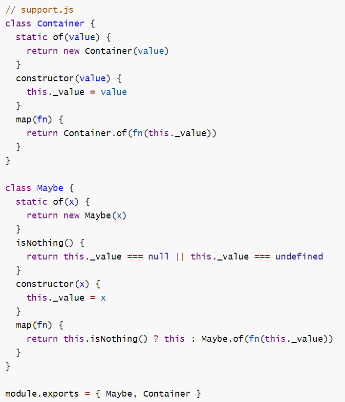

## 简答题

打开 code / 简答题.md 文件,   根据其中题目答题并保存

## 代码题

#### 准备工作

- 进入 code 目录, 
- 初始化项目生成 package.json
- 并且安装 lodash

#### 代码1

打开 code / code1.js , 按其中要求编写完成代码

　

#### 代码2

打开 code / code2.js 编辑补全代码, 完成4个练习要求

　

#### 代码3

**1) 参照下面图片敲代码, 创建 code / support.js 文件**

**2) 打开 code / code3.js 编辑补全代码, 完成4个练习要求**

　

#### 代码4

打开 code / MyPromise.js , 尽可能还原 Promise 中的每一个函数, 并通过注释描述思路和原理

　
#
## 简答题

#### 谈谈你是如何理解 JS 异步编程的，EventLoop、消息队列都是做什么的，什么是宏任务，什么是微任务？

**答:**

JavaScript执行代码的线程是唯一的，所以任务都是由该线程完成。因此，如果是耗时的同步任务，会对线程阻塞。

具体要看我们开发运行环境所提供的api，如果是同步的，需要等待操作执行完毕，才会继续往下执行，如果是异步的一般通过以下四个方式实现：
1. 回调函数
2. 事件监听
3. 发布/订阅
4. Promises对象

异步执行相关的概念：
* 主队列会根据压栈顺序执行主队列里的任务表。
* Web API的线程执行完的延时操作，会将对应的反馈传入消息队列。
* eventloop是一个不断跑的一个圈，不停的检测消息队列里面的待执行任务。
* 如果当前主队列已经执行完全部的任务，就对这些待执行任务压栈，逐个执行这些待执行任务。

宏任务与微任务：
* 宏任务：当需要执行时放在消息队列的末尾，等待下一次eventloop的刷新周期，再放到主队列执行。
* 微任务：当前任务的一个微任务，在当前任务结束过后立即执行。

执行的顺序是 主队列 > 微任务 > 宏任务，及其使用的场景
* 宏任务：整体代码script，setTimeout，setInterval
* 微任务：Promise，process.nextTick(nodejs)